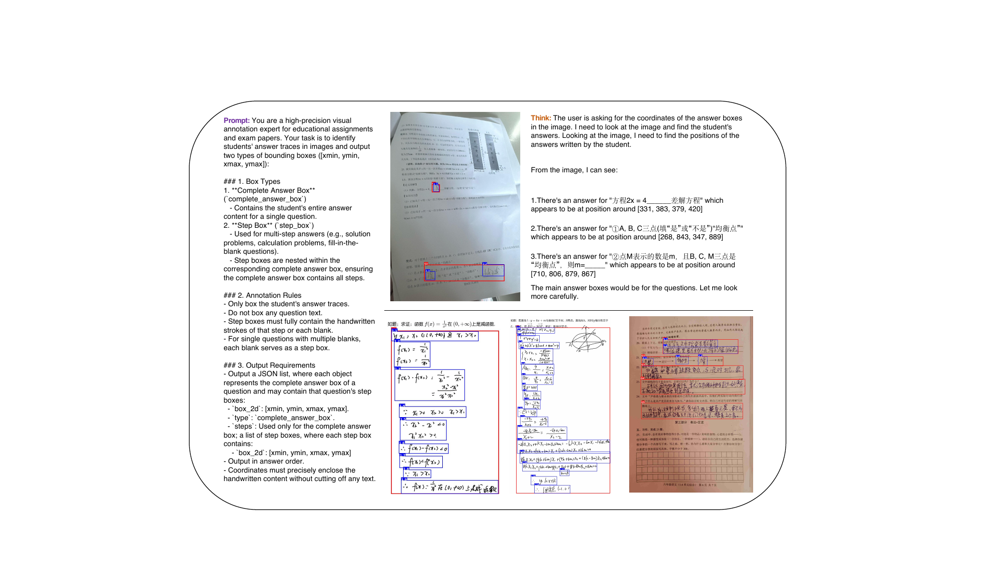

<p align="center">
  
</p>

<h1 align="center">HG-Bench</h1>

<p align="center">
  <b>Multi-Page Handwritten Answer-Region Grounding for Automated Homework Assessment</b>
</p>

<p align="center">
  <a href="https://hg-bench.github.io/"></a>
  <a href="paper.pdf"></a>
  <a href="evaluate.py"></a>
  
</p>

<p align="center">
  Chuangxin Zhao · Boyan Shi · Yanling Wang · Yijian Lu · Canran Xiao · Jiali Chen · Jun Xia · Yan Wang · Ji Qi<sup>†</sup> · Juanzi Li<sup>†</sup>
  <br>
  <sub><sup>†</sup>Corresponding authors · <a href="https://hg-bench.github.io/">Full author affiliations</a></sub>
</p>

---

**HG-Bench** is a **500-sample** benchmark for **page-aware, two-level answer-region grounding** on multi-page handwritten K–12 homework. This repository contains:

- the **official evaluator** (`evaluate.py`) and **VLM prompt** (`prompt.py`);
- **sample data** and **canonical paper numbers** for reproduction;
- the **project page** (`index.html`) served at **[hg-bench.github.io](https://hg-bench.github.io/)**.

> For figures, main results, qualitative cases, and the full task definition, visit the **[project page](https://hg-bench.github.io/)**.

## Highlights

| | |
|---|---|
| **500** test samples | Stratified K–12 homework from a 1.49M-image pool |
| **2-level grounding** | Question-level $\mathcal{F}_A$ + step-level $\mathcal{F}_S^{\mu}$ |
| **9 baselines** | Frontier APIs and open-weight VLMs under a unified protocol |
| **Zero dependencies** | Pure Python 3.8+ standard library |

## Quick start

```bash
git clone https://github.com/hg-bench/hg-bench.github.io.git
cd hg-bench.github.io
python evaluate.py --combined examples/sample_combined.jsonl
```

Expected output:

```
HG-Bench evaluation results
==================================================
  N (total)              : 5
  N (parse-success)      : 5
  Succ%                  : 100.00
--------------------------------------------------
  F_A   (title_f1)       : 20.00
  F_S^mu (micro_gt_pages): 4.00
  F_S^M  (macro_gt_samples): 2.78
  S_bar (report_all)     : 10.83
  report (success-only)  : 10.83
==================================================
```

## Repository layout

```
├── index.html              # project page → https://hg-bench.github.io/
├── paper.pdf               # preprint PDF
├── evaluate.py             # official evaluator (entry point)
├── prompt.py               # official VLM prompt
├── examples/               # 5-sample sanity-check files
└── results/                # canonical numbers from paper Table 2
```

## Evaluate your model

**1. Generate predictions** — one JSONL line per sample:

```json
{"uuid": "<same as GT>", "predict": "<raw VLM output>", "success": true}
```

Use the prompt in [`prompt.py`](prompt.py). See [`examples/sample_predictions.jsonl`](examples/sample_predictions.jsonl) for the schema.

**2. Run the evaluator**

```bash
python evaluate.py --pred predictions.jsonl --gt gt.jsonl
```

**3. Verify against paper numbers**

```bash
python -c "
import json
for m in json.load(open('results/homework_grounding_500_all_metrics.json')):
    r = m['scores']['results']
    print(f\"{m['display_name']:35s}  F_A={r['title_f1']:5.2f}  F_S_mu={r['step_f1_micro_gt_step_pages']:5.2f}\")
"
```

## Dataset & checkpoint

The full **500-sample test set** and **reference checkpoint** will be released on Hugging Face. Until then, use `examples/` to validate your setup.

## CLI reference

```
python evaluate.py [-h]
    [--combined COMBINED]              # OR  --pred + --gt
    [--pred PRED] [--gt GT]
    [--iou-thr 0.5]
    [--step-weight 0.5]
    [--coord-format {auto,pixel}]
    [--out scores.json]
```

Run `python evaluate.py -h` for the full list of options.

## Citation

```bibtex
@article{hgbench2026,
  title   = {{HG-Bench}: A Benchmark for Multi-Page Handwritten Answer-Region
             Grounding in Automated Homework Assessment},
  author  = {Chuangxin Zhao and Boyan Shi and Yanling Wang and Yijian Lu and
             Canran Xiao and Jiali Chen and Jun Xia and Yan Wang and
             Ji Qi and Juanzi Li},
  journal = {arXiv preprint arXiv:2603.XXXXX},
  year    = {2026}
}
```
